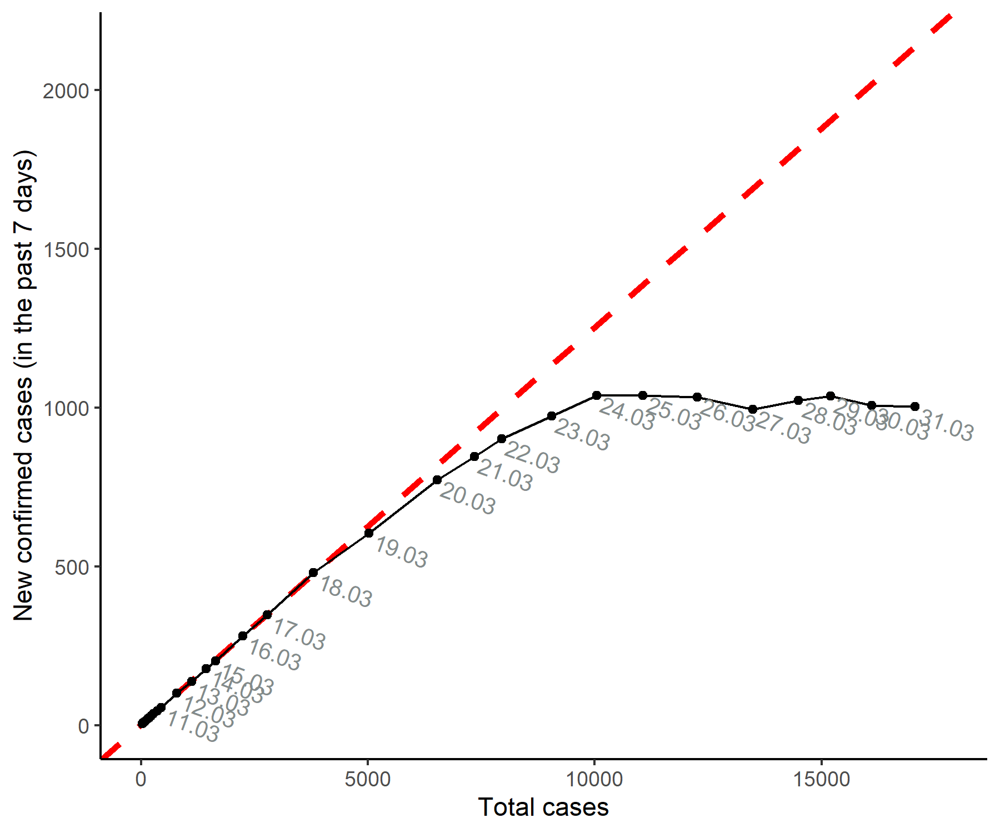

# covid19-new-cases-vs-total

A simple [R script](covid-19_R-script.R) to plot covid-19 data in Switzerland (from https://www.corona-data.ch/ and https://github.com/daenuprobst/covid19-cases-switzerland) as suggested by https://www.youtube.com/watch?v=54XLXg4fYsc.

Here is the linear plot:

and the logarithm plot:

Last update : 2020-03-31
